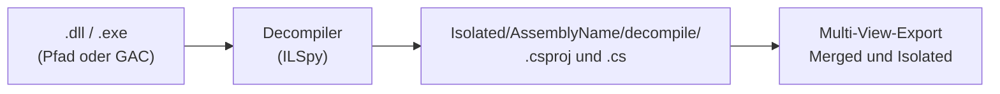

# SourceToAI – KI-Feed aus .NET-Quellen


[](https://opensource.org/licenses/MIT)

**SourceToAI** ist ein eigenständiges .NET-10-CLI-Tool. Es liest lokale C#-Solutions **oder decompiliert kompilierte .NET-Assemblies** (`.dll`/`.exe` per Pfad oder aus dem GAC) und erzeugt daraus **Markdown-KI-Feeds** mit Metadaten, Manifest und mehreren „Views“ (vollständiger Code, Signaturen, öffentliche API, DTO-Fokus). Alles läuft offline auf deiner Maschine.

---

## Was es macht

- **Multi-View-Export:** In den Ordnern `complete/`, `signatures-only/`, `public-only/` und `dto-only/` liegt pro Projekt jeweils **eine** Markdown-Datei. Dateinamen tragen das View-Suffix: `<Solution>.<Projekt>_<view>.md` (z. B. `MySol.Proj_complete.md`). Virtuelle Solution-Doku (Root-`README`, flaches `Docs/` mit `.md`/`.mdc`, `.cursor/rules` usw.) erscheint in `complete/` als `<Solution>.Docs_complete.md`.
- **Namespace-basiertes Splitting (Große Projekte aufteilen):** Große C#-Projekte können automatisch und intelligent in mehrere kleinere, logisch zusammenhängende Markdown-Feeds aufgeteilt werden. Das Splitting basiert auf der C#-Namespace-Hierarchie unter Berücksichtigung von Dateigrößen-Soft-Limits (`--max-file-size`) und einer harten Obergrenze der Dateianzahl (`--max-file-count`).
- **Mehrere Quellen in einem Lauf:** Du gibst **ein** globales Export-Ziel und **eine oder mehrere** Quellen an. Jede Quelle wird nacheinander verarbeitet. Workspace-weite AI-Kontextdateien fließen in den gemeinsamen Baum `Merged/` ein, isolierte projektbezogene Dateien landen in `Isolated/<SolutionName>/`.
- **Quellen:** Verzeichnis mit `.sln`/`.csproj` (typisch Repository- oder Solution-Stamm), eine **.dll/.exe** per Dateipfad oder Assemblys aus dem **.NET-Framework-GAC** (siehe Abschnitt [Assemblies decompilieren](#assemblies-decompilieren-dll--exe-und-gac)).
- **Robustheit:** Build-Artefakte und übliche Tool-Ordner werden standardmäßig ignoriert; Lesefehler in Unterzweigen führen zu Warnungen, nicht zum kompletten Abbruch.

---

## Assemblies decompilieren (DLL / EXE und GAC)

Ohne Quellcode-Repositories kannst du **kompilierte .NET-Assemblies** als Eingabe nutzen. SourceToAI erkennt `.dll` und `.exe`, **decompiliert** sie mit der [ILSpy](https://github.com/icsharpcode/ILSpy)-Engine (`ICSharpCode.Decompiler`) in ein vollständiges C#-Projekt und exportiert danach wie bei einer normalen Solution.



| Weg | CLI | Hinweise |
|-----|-----|----------|
| **Dateipfad** | Positionsargument oder `--input` auf eine existierende `.dll`/`.exe` | Optional Wildcards im **letzten** Segment (`Contoso.*.dll`); CMD/PowerShell expandieren das nicht — SourceToAI löst es auf. |
| **GAC** | `--gac <Dateinamen-Muster>` (mehrfach) | Nur unter Windows mit .NET-Framework-GAC (`%WINDIR%\Microsoft.NET\assembly`). Pro Assembly-Name + Public-Key-Token die **höchste** Version; bei gleicher Identität in mehreren Flavors: **MSIL** vor 32 vor 64. |

Beide Wege können **im selben Lauf** mit Verzeichnis-Quellen kombiniert werden (z. B. eigenes Repo plus eine Vendor-DLL aus dem GAC). Der decompilierte Baum bleibt unter **`Isolated/<AssemblyName>/decompile/`** erhalten (nützlich zum Nachschlagen oder erneuten Export).

**Abhängigkeiten:** Der Decompiler sucht Referenzen im Ordner der Assembly und per Framework-Auflösung. Fehlen Abhängigkeiten, kann der Lauf für diese Assembly fehlschlagen (Details in der Konsole); der Export anderer Quellen im selben Lauf wird trotzdem versucht.

---

## Namespace-basiertes Splitting (Große Projekte aufteilen)

Wenn C#-Projekte sehr groß werden (z. B. über 1,5 MB Markdown-Code), stoßen Web-LLMs oft an Kontextgrenzen oder verlieren den roten Faden. Um dies zu verhindern, bietet SourceToAI ein intelligentes, vollautomatisches Splitting-Feature (**Adaptive Namespace-Clustering**).

Das Feature analysiert die C#-Namespace-Hierarchie als Baum und fusioniert kleinere, zusammengehörige Namensräume bottom-up so, dass die gewünschten Grenzwerte perfekt eingehalten werden.

### Funktionsweise & Features

- **Harte Dateigrenze (`--max-file-count`):** Stellt sicher, dass pro realem C#-Projekt niemals mehr als die konfigurierte Anzahl an Markdown-Dateien erzeugt werden. Dies ist nützlich für Web-LLMs mit Upload-Limits (z. B. maximal 8 oder 10 Dateien).
- **Dateigrößen-Richtwert (`--max-file-size`):** Richtgröße in Kilobyte, die eine einzelne Markdown-Datei anstreben soll (Soft-Limit). Wird bei Bedarf überschritten, um die harte Obergrenze der Dateianzahl zu wahren.
- **Saubere Trennung:** 
  - Nicht-C#-Dateien (z. B. `.json`, `.sql`, `.html`, `.css`) werden sauber in einen separaten **Asset-Feed** (`_Assets`) ausgelagert.
  - C#-Dateien ohne Namespace (`Program.cs` etc.) werden standardmäßig **nicht** als eigener Core-Feed exportiert, sondern in die kleinsten bestehenden Namespace-Feeds umverteilt (`SuppressCorePartition: true` in `appsettings.json`). Legacy-Verhalten: `--no-suppress-core` oder `"SuppressCorePartition": false`.
- **Garantierte Explorer-Sortierung:** Alle generierten Feeds werden mit dem Hauptprojekt über einen Unterstrich `_` verbunden (z. B. `MyProj_Auth_complete.md`, `MyProj_complete.md`). Dadurch werden alle Feeds des Hauptprojekts im Datei-Explorer **lückenlos untereinander** einsortiert und sauber von eventuellen Test-Projekten (`MyProj.Tests_complete.md`) getrennt.
- **Aktivierung:** Das Feature ist aktiv, sobald **sowohl** `--max-file-size` **als auch** `--max-file-count` größer als `0` sind (oder in `appsettings.json` konfiguriert).

---

## Nutzung mit Web-KIs (Kurz)

1. Export ausführen (siehe unten).
2. Aus dem gemeinsamen Ordner `Merged/complete/` die passenden `<Solution>.Docs_complete.md`- und Projekt-MD-Dateien (z. B. `..._complete.md` bzw. `..._SubNamespace_complete.md`) in den Chat laden.
3. Im Prompt auf Manifest-Einträge und Views verweisen (Überblick: generiertes `readme.md` im Export-Root; Details pro Lösung: `Isolated/<Solution>/readme.md`).

---

## Installation

1. Unter [Releases](../../releases) die passende ZIP für dein Betriebssystem laden und entpacken, **oder**
2. Repository klonen und mit [.NET 10 SDK](https://dotnet.microsoft.com/download) bauen: `dotnet build` / `dotnet run --project SourceToAI.CLI`.

Für ein einzelnes, portables Binary: im CLI-Projekt z. B. `dotnet publish -c Release -r win-x64 -p:PublishSingleFile=true` (siehe Kommentar in `SourceToAI.CLI.csproj`).

---

## Kommandozeile

**Syntax (eine Variante wählen – nicht mischen):**

- **Positionsargumente:** `SourceToAI <Export-Pfad> <Quelle> [<Quelle> …]` oder nur Export plus `--gac`
- **Optionen:** `SourceToAI --export <Export-Pfad> [--input <Quelle> …] [--gac <DLL-Muster> …] [--exclude <Glob> …] [--max-file-size <kb>] [--max-file-count <anzahl>]` (Kurzform: `-i`)

**Quelle** ist jeweils ein existierendes **Verzeichnis** (Solution/Repo mit `.sln` oder `.csproj`) oder eine **.dll**-/.**exe**-Assembly (wird decompiliert, siehe oben). Alternativ oder zusätzlich liefert **`--gac`** Assembly-Pfade aus dem .NET-Framework-GAC (ebenfalls decompiliert). Mindestens ein Quellpfad oder mindestens ein `--gac`-Muster ist erforderlich.

**`--gac`:** Mehrfach angebbare **Dateinamen-Muster** (`*`, `?`) für DLLs im GAC (z. B. `Contoso.*.dll`). Details zur Auflösung: Abschnitt [Assemblies decompilieren](#assemblies-decompilieren-dll--exe-und-gac). Der GAC-Root wird automatisch unter `%WINDIR%\Microsoft.NET\assembly` ermittelt; optional überschreibbar über `GacAssemblyRoot` in `appsettings.json`. Liefert ein angegebenes Muster keinen Treffer, bricht die CLI mit einer klaren Meldung ab.

**Optional `--exclude`:** Mehrfach angebbare Glob-Muster ([`Microsoft.Extensions.FileSystemGlobbing`](https://learn.microsoft.com/en-us/dotnet/core/extensions/file-globbing)), ausgewertet **relativ zum Projektstamm** (Ordner der jeweiligen `.csproj`) und **zusätzlich relativ zur Solution-/Eingabe-Wurzel** (wichtig für Ordner direkt unter der Wurzel ohne eigenes `.csproj`, z. B. `ExternalTools`). Sie wirken auf den rekursiven Dateiscan (View `complete`, Unmapped-Ordner, eingebettete Nicht-C#-Dateien), nicht auf die separat erfassten Solution-Doku-Pfade (Root-`README`, `.cursor/rules`, `.github/workflows`, flaches `Docs/`). Muster aus der CLI werden an `ExcludedPathPatterns` in `appsettings.json` **angehängt**. `*` deckt ein Pfadsegment ab; `**` beliebige Tiefe. Ein Ordnername **ohne Wildcards** (z. B. `ExternalTools`) schließt den gesamten Unterbaum ein; alternativ `ExternalTools/**`. `wwwroot/lib/*` nur direkte Kindelemente von `lib`, für den **gesamten Unterbaum** `wwwroot/lib/**`.

**Optional `--max-file-size <kb>`:** Aktiviert das adaptive Namespace-Splitting mit dem angegebenen Richtwert für die maximale Größe einer einzelnen Markdown-Datei (in KB). Standard: `0` (deaktiviert). Muss zusammen mit `--max-file-count` > 0 verwendet werden.

**Optional `--max-file-count <anzahl>`:** Die harte Obergrenze für die Anzahl der generierten Markdown-Dateien pro realem C#-Projekt (z. B. maximal `8` Dateien). Standard: `0` (deaktiviert).

**Optional `--no-suppress-core`:** Legacy-Modus — C#-Dateien ohne Namespace wieder als eigene Core-Partition (`MyProj_Core_complete.md`) exportieren. Standard (ohne Flag): Umverteilung in kleinste Namespace-Feeds; steuerbar auch über `SuppressCorePartition` in `appsettings.json`.

**Platzhalter (`*`, `?`) im letzten Pfadsegment:** Unter Windows löst die Shell solche Muster nicht auf. SourceToAI expandiert sie vor der Verarbeitung zu konkreten Datei- und Verzeichnispfaden (wie `Directory.GetFiles` / `GetDirectories`). Liefert ein Muster keinen Treffer oder fehlt der Basisordner, bricht die CLI mit einer klaren Meldung ab. Rekursive Muster (z. B. `**\*.dll`) werden nicht unterstützt.

**Beispiele:**

```cmd
SourceToAI C:\AI_Feeds\Exports C:\Daten\RepoA\ C:\Daten\RepoB\
```

```cmd
SourceToAI C:\AI_Feeds\Exports C:\Apps\MyLib\bin\Debug\net10.0\MyLib.dll
```

```cmd
SourceToAI C:\AI_Feeds\Exports "C:\Apps\ContosoTools\bin\Release\net10.0\Contoso.*.dll"
```

```cmd
SourceToAI --export ./exports -i C:\Daten\RepoA\ -i C:\Daten\RepoB\
```

```cmd
SourceToAI C:\AI_Feeds\Exports --gac "Contoso.*.dll" --gac "Acme.Core.*.dll"
```

```cmd
SourceToAI C:\AI_Feeds\Exports --gac "System.Data.dll"
```

```cmd
SourceToAI --export ./exports --input C:\Daten\RepoA\ --gac "Contoso.*.dll"
```

```cmd
SourceToAI C:\AI_Feeds\Exports C:\Daten\MeinWeb\ --gac "Vendor.Lib.*.dll"
```

```cmd
SourceToAI C:\AI_Feeds\Exports C:\Daten\MeinWeb\ --exclude "wwwroot/lib/**" --exclude "ExternalTools" --exclude "**/vis-timeline-graph2d.min.js" --exclude "**/vis-timeline-graph2d.min.css"
```

---

## Ausgabeordner und Sicherheit

Unter dem globalen `<Export-Pfad>` bereitet das Tool einen Verzeichnisbaum vor:
- Ein **globales** `readme.md` im Export-Root: erklärt für KI-Nutzerinnen und -nutzer den Aufbau (`Isolated/` vs. `Merged/`), die vier Views und empfiehlt `rg`/`grep` bei großen Bäumen.
- Pro erkannte Solution zusätzlich `Isolated/<SolutionName>/readme.md` mit den tieferen Hinweisen zu MANIFEST/CONTENT und den relativen Pfaden **unter dieser Lösung**.
- Ein Verzeichnis `Merged/`, in dem alle Projekte aller exportierten Solutions vereint und nach Views gruppiert liegen.
- Ein Verzeichnis `Isolated/`, in dem jede Solution (z. B. `<SolutionName>`) ihren eigenen Unterordner behält. Dort finden sich z. B. der lösungsspezifische `dependency-graph.md` und bei Assembly-Quellen zusätzlich `decompile/` mit dem erzeugten C#-Baum.

**Wichtig:** Bevor ein bestehender globaler Exportordner überschrieben wird, muss direkt im `<Export-Pfad>` die von SourceToAI angelegte Markerdatei **`.sta-marker`** liegen. Fehlt sie (z. B. Ordner war nie ein SourceToAI-Export oder wurde manuell angelegt), bricht die CLI ab, um **versehentlichen Datenverlust** zu vermeiden. Zum erneuten Export: Ordner leeren oder bewusst `.sta-marker` anlegen – siehe Konsolenmeldung.

---

## Konfiguration (`appsettings.json`)

Die Datei muss **neben der ausführbaren Datei** liegen (wird mit ausgeliefert). Dort werden u. a. ignorierte Verzeichnisse und erlaubte Dateiendungen festgelegt.

```json
{
    "SourceToAI": {
        "ExcludedDirectories": [ "bin", "obj", ".git", ".vs", ".idea", "node_modules" ],
        "ExcludedPathPatterns": [ "wwwroot/lib/**" ],
        "GacAssemblyRoot": null,
        "MaxFileSizeKb": 0,
        "MaxFileCount": 0,
        "SuppressCorePartition": true,
        "IncludedExtensions": [
            ".cs", ".sql", ".json", ".xml", ".xaml", ".yml", ".md", ".mdc", ".js", ".ts", ".css",
            ".cshtml", ".html", ".http", ".razor", ".svg", ".txt", ".csproj"
        ]
    }
}
```

Die Liste entspricht den Fallback-Defaults in `AppSettings.cs` und der mitgelieferten `appsettings.json`. `ExcludedDirectories` sind weiterhin **nur Verzeichnisnamen** (ein Segment, z. B. `bin`), die an jeder Ebene übersprungen werden. `ExcludedPathPatterns` sind optionale **Glob-Pfade** relativ zum Projektordner und zur Solution-Wurzel (siehe `--exclude` oben). Dateien mit den konfigurierten Endungen unterhalb jeder gefundenen `.csproj` (z. B. `wwwroot/`) werden in der View **`complete`** als Text eingebettet; C#-spezifische Views nutzen weiterhin nur `.cs` (Roslyn). **XAML**, **Razor** und **HTML** laufen nicht durch den C#-Parser, sondern über den gleichen Verzeichnis-Scan wie andere Textdateien.

**Grenzen (Stand heute):** Unter einem **Verzeichnis**-Eingabepfad muss mindestens eine `*.csproj` existieren — reine Static-Sites ohne .NET-Projekt werden nicht erkannt. **Assembly-Eingaben** (Pfad oder GAC) brauchen kein vorgefertigtes Repo; die `.csproj` entsteht durch die Decompilierung. GAC-Zugriff setzt einen Windows-.NET-Framework-GAC voraus. Binärdateien (z. B. `.png`, Schriftarten) werden nicht in den Markdown-Feed übernommen.

---

## Lizenz

MIT – siehe [LICENSE](LICENSE).
