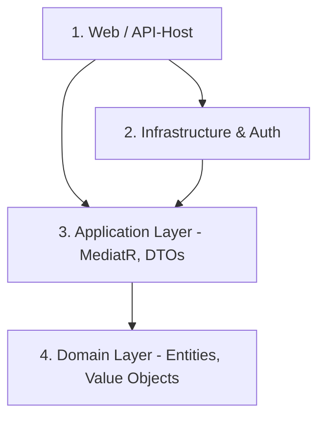

# Analyse & Vorschläge: Projekt-Restrukturierung & Kontext-Splitting für SourceToAI

Dieses Dokument analysiert die im [Konzept](file:///c:/Daten/Entwicklung/Ralf/SourceToAI/todo/split-project-in-multiple-files/Konzept.md) beschriebenen Herausforderungen bei sehr großen Code-Feeds (> 1.6 MB) und liefert konkrete, praxistaugliche Vorschläge für die Restrukturierung von .NET-Projekten sowie für ein intelligentes, namespace-basiertes Splitting-Feature in **SourceToAI**.

---

## 1. Problem-Validierung: Warum große Markdown-Dateien Web-LLMs überfordern

Obwohl moderne Web-LLMs (wie Gemini 1.5 Pro oder Claude 3 Opus/3.5 Sonnet) Kontextfenster von 200.000 bis zu 2 Millionen Tokens besitzen, führt das Einspielen einer einzigen 1.6 MB großen Markdown-Datei (ca. 400.000 Tokens an Quellcode) in der Praxis zu massiven Problemen:

* **Das „Needle in a Haystack“-Problem (Aufmerksamkeitsverlust):** LLMs neigen dazu, Details in der Mitte extrem langer Prompts zu übersehen oder falsch zu gewichten. Je mehr irrelevanter Code geladen wird, desto ungenauer und generischer werden die Antworten.
* **Rausch-Signal-Verhältnis (Noise-to-Signal):** Wenn du eine Frage zu einem bestimmten MediatR-Handler hast, lenken 1.5 MB an DTOs, EF-Core-Konfigurationen und Auth-Logik das Modell ab.
* **Latenz & Token-Verbrauch:** Die Antwortzeit steigt spürbar an, und in Web-Chats läuft man extrem schnell in Token-Limits pro Minute (TPM) oder Nachrichtengrenzen pro Stunde.
* **Unbekannter Kontext im Voraus:** Da man im Chat-Verlauf oft spontan tiefer bohren muss, ist eine rein manuelle Vorselektion („Ich kopiere jetzt Datei X und Y zusammen“) mühsam und bricht den kreativen Arbeitsfluss.

---

## 2. Projekt-Restrukturierung (Architektur-Empfehlungen)

Deine Sorge vor der **„Projekt-Explosion“** (z. B. 20 fachliche Projekte + 20 Testprojekte = 40+ csproj in einer Solution) ist absolut berechtigt. Dieses Anti-Pattern (oft *Assembly-itis* genannt) führt zu:
1. **Langsameren Builds & IDE-Verzögerungen** (Roslyn muss 40 Abhängigkeitsgraphen verwalten).
2. **Hohem Boilerplate-Aufwand** (unzählige Projekt-Referenzen und NuGet-Paket-Synchronisationen).
3. **Kognitiver Überlastung** beim Navigieren im Solution Explorer.

### Empfehlung A: Vertical Slice Architecture (Feature Folders)
Anstatt Code technisch aufzuteilen (ein Projekt für alle Handler, eins für alle Controller, eins für alle Models), ordnest du den Code in **einem** großen Projekt nach **fachlichen Features**.

```
San.smart.Planner.Platform/
├── Features/
│   ├── Bookings/
│   │   ├── BookRoomCommand.cs
│   │   ├── BookRoomHandler.cs
│   │   ├── BookingDto.cs
│   │   └── BookingController.cs
│   ├── Planning/
│   │   ├── CreatePlanCommand.cs
│   │   ├── CreatePlanHandler.cs
│   │   └── PlanDto.cs
│   └── Authentication/
│       ├── LoginCommand.cs
│       └── ...
```

> [!TIP]
> **Der große Vorteil für SourceToAI:**
> Die Namespaces spiegeln exakt diese Struktur wider (`San.smart.Planner.Platform.Features.Bookings`). SourceToAI kann so später spielend leicht fachliche Schnitte machen, da zusammenhängender Code im selben Namespace-Zweig liegt!

### Empfehlung B: Die „Regel der 3-5 Projekte“
Für eine saubere Trennung ohne Wildwuchs hat sich ein logischer 4-Schichten-Schnitt bewährt. Jedes dieser Projekte fasst mehrere fachliche Domänen in Ordnern zusammen:



1. **`*.Domain`** (Reiner Core, keine externen Abhängigkeiten, Entities, Interfaces).
2. **`*.Application`** (Use Cases, Handlers, DTOs, Validation, Interfaces). *Hier liegt meist der meiste Code.*
3. **`*.Infrastructure`** (EF Core, Auth-Implementierungen, externe APIs, File-Storage).
4. **`*.Web`** / **`*.Api`** (Controller, Minimal APIs, Middleware, statische Assets wie `wwwroot`).
5. **`*.Tests`** (Ein **einziges** Testprojekt für die gesamte Solution!).

> [!IMPORTANT]
> **Konsolidierung der Testprojekte:**
> Verwende **nur ein** Unit-/Integrationstestprojekt. Strukturiere es intern mit Ordnern, die den echten Projekten entsprechen (z. B. `Tests/Application/Bookings/...`). Das spart enorm viel Overhead und verhindert die Verdopplung der Projektanzahl!

---

## 3. SourceToAI: Design für automatisches Kontext-Splitting

Um die Markdown-Größen flexibel zu steuern, können wir in SourceToAI eine intelligente Aufteilung integrieren. C#-Namespaces sind das einzig verlässliche semantische Merkmal, das wir ohne tiefes Fachwissen analysieren können.

Wir schlagen zwei komplementäre Konzepte vor, die optional per CLI/Config gesteuert werden.

### Konzept 1: Explizites Namespace-Segment-Splitting (Gezielte Exporte)
Der Benutzer definiert in der `appsettings.json` oder per CLI-Parameter, nach welchen Schlüsselbegriffen im Namespace aufgeteilt werden soll.

**Konfiguration (`appsettings.json`):**
```json
{
  "SourceToAI": {
    "Splitting": {
      "Enabled": true,
      "MaxFileSizeKb": 500,
      "TargetNamespaceSegments": [ "Features", "Handlers", "Domain", "Infrastructure" ]
    }
  }
}
```

**Wie es arbeitet:**
1. Der Roslyn-Parser ermittelt für jede `.cs`-Datei den vollständigen Namespace.
2. Wenn ein Segment aus `TargetNamespaceSegments` im Namespace vorkommt (z. B. `San.smart.Planner.Platform.Features.Bookings` -> Treffer bei `Features`), wird diese Datei einem virtuellen Sub-Projekt zugeordnet (z. B. `Platform.Features.Bookings`).
3. Alle Dateien, die keinen Treffer landen oder keine `.cs`-Dateien sind (z. B. `wwwroot`), verbleiben im Standard-Projekttopf.
4. Jedes dieser Sub-Projekte wird in eine eigene Markdown-Datei exportiert:
   * `San.smart.Planner.Platform.Features.Bookings-complete.md` (Sehr fokussiert, ca. 80 KB)
   * `San.smart.Planner.Platform.Infrastructure-complete.md` (ca. 120 KB)
   * `San.smart.Planner.Platform.Rest-complete.md` (Alles andere, ca. 200 KB)

---

### Konzept 2: Adaptive Größen-Clustering (Bin-Packing für Namespaces)
Wenn der Benutzer keine Namespaces manuell konfigurieren möchte, kann SourceToAI den Code vollautomatisch anhand einer Zielgröße (z. B. `MaxFileSizeKb = 500`) clustern.

**Algorithmus:**
1. **Scannen & Größenermittlung:** Ermittle für jede `.cs`-Datei die exportierte Textgröße.
2. **Namespace-Gruppierung:** Gruppiere alle Dateien nach ihrer Namespace-Hierarchie auf einer konfigurierbaren Tiefe $D$ (z. B. Tiefe 3: `San.smart.Planner.Platform.Features.Bookings` und `San.smart.Planner.Platform.Features.Billing`).
3. **Größenberechnung:** Berechne die Summe der Dateigrößen pro Gruppe.
4. **Greedy Bin-Packing:**
   * Sortiere die Namespace-Gruppen absteigend nach Größe.
   * Packe die Gruppen nacheinander in eine "Markdown-Packtasche" (Bucket), bis die Grenze von `MaxFileSizeKb` erreicht ist.
   * Sobald ein Bucket voll ist, wird ein neuer Bucket geöffnet.
5. **Ergebnis:** Du erhältst vollautomatisch austarierte Markdown-Dateien mit logisch zusammenhängendem Code, z. B.:
   * `San.smart.Planner.Platform.Features.Bookings-complete.md`
   * `San.smart.Planner.Platform.Features.Billing-complete.md`
   * `San.smart.Planner.Platform.CoreAndRest-complete.md`

---

## 4. Architektonischer Integrationsplan in SourceToAI

Ein genialer Aspekt des SourceToAI-Designs ist, dass der restliche Pipeline-Fluss (Roslyn-Umschreibung, Markdown-Generierung, Manifest-Erstellung, Dateischreiben) bereits perfekt funktioniert. 

Um das Splitting-Feature wartungsfreundlich und sauber zu integrieren, sollten wir das Splitting **„ganz vorne“ in der Kette** durchführen. Wir teilen ein reales C#-Projekt in mehrere **virtuelle Projekte** auf, bevor wir sie in die parallele Generierung schicken.

### Der Datenfluss vor und nach der Änderung:

```mermaid
seqdiagram
    [FileDiscovery] -- 1. Reale Projektdateien --> [MultiViewExportService]
    note over [MultiViewExportService]: HEUTE: Erzeugt 1 WorkSlot pro realem Projekt
    note over [MultiViewExportService]: NEU: Führt Namespace-Analyse aus und teilt in N virtuelle Projekte auf
    [MultiViewExportService] -- 2. Virtuelle Projekt-Dateien --> [IMarkdownProjectViewBuilder]
    [IMarkdownProjectViewBuilder] -- 3. Generiert Segmente --> [IAiFeedMarkdownComposer]
    [IAiFeedMarkdownComposer] -- 4. Schreibt getrennte Dateien --> [Output-Ordner]
```

### Konkrete Code-Skizze für `MultiViewExportService.cs`

Wir können in `MultiViewExportService.WriteMergedSolutionViews` die Liste `projectsWithFiles` vor der Schleife filtern und aufsplitten. 

Hier ist eine vereinfachte C#-Skizze, wie sich das elegant integrieren lässt, ohne bestehenden Code zu gefährden:

```csharp
// In MultiViewExportService.cs

// 1. Hole Einstellungen aus der Config
var splittingEnabled = appSettings.SourceToAI.Splitting.Enabled;
var maxKb = appSettings.SourceToAI.Splitting.MaxFileSizeKb;
var targetSegments = appSettings.SourceToAI.Splitting.TargetNamespaceSegments;

var exportUnits = new List<(ProjectDefinition Project, IReadOnlyList<string> Paths, bool DocsOnlyInCompleteView)>();

foreach (var (project, paths) in orderedProjects)
{
    if (paths.Count == 0) continue;

    if (splittingEnabled && IsProjectEligibleForSplitting(project, paths, maxKb))
    {
        // Spalte Pfade anhand der Namespaces auf
        var subProjects = SplitProjectByNamespace(project, paths, targetSegments, maxKb);
        foreach (var sub in subProjects)
        {
            exportUnits.Add((sub.Project, sub.Paths, false));
        }
    }
    else
    {
        exportUnits.Add((project, paths, false));
    }
}
```

#### Vorteile dieser Architektur:
1. **Keine Änderungen an Roslyn-Rewritern:** Die View-Builder und Rewriter arbeiten einfach mit den ihnen übergebenen Pfad-Listen.
2. **Automatisches Manifest:** Jedes gesplittete Markdown-File erhält sein eigenes, voll funktionsfähiges Manifest, das exakt zu den enthaltenen Dateien passt.
3. **Volle Parallelität:** Die verschiedenen Teile des großen Projekts werden vollautomatisch parallel verarbeitet (bounded parallel).
4. **Abwärtskompatibilität:** Wenn das Feature deaktiviert ist, bleibt das Verhalten zu 100% identisch zum Status Quo.

---

## 5. Konkreter Fahrplan zur Umsetzung

Wenn du dieses Feature umsetzen möchtest, empfehlen wir folgendes Vorgehen:

### Phase 1: Die „Schnittstellen-Vorbereitung“ (Namespace-Extraktor)
Wir erstellen einen schnellen Namespace-Extraktions-Service (z. B. `NamespaceDiscoveryService`), der mittels einer extrem schnellen Regex oder eines simplen Roslyn-Syntax-Scans den Namespace einer `.cs`-Datei ermittelt, ohne die Datei komplett kompilieren zu müssen.
*Tipp: Da Roslyn-Dokumente im `ICSharpDocumentLoader` sowieso schon geladen und geparst werden, können wir den Namespace dort direkt aus der `CompilationUnitSyntax` auslesen!*

### Phase 2: Implementierung des Splitting-Algorithmus
Implementierung der Splitting-Logik in einer separaten Hilfsklasse (z. B. `ProjectSplittingEngine`), um den `MultiViewExportService` nicht mit logischem Overhead zu überladen.

### Phase 3: Integration in CLI & Config
Erweiterung der `appsettings.json` und Hinzufügen eines CLI-Schalters wie `--split` oder `--max-size <kb>`, damit das Feature direkt auf der Kommandozeile genutzt werden kann.

---

### Fazit & Empfehlung

Dein Gedankengang, die Markdown-Dateien fachlich nach Namespaces zu splitten, ist **die absolut eleganteste und robusteste Lösung** für dieses Problem. Sie bekämpft das Problem an der Wurzel, ohne dass du gezwungen bist, deine Visual-Studio-Solution künstlich in Dutzende Kleinst-Projekte zu zerlegen. 

Durch das Einbetten des Splittings als „virtuelle Projekte“ ganz am Anfang des Export-Prozesses bleibt die exzellente und hochgradig parallele Architektur von **SourceToAI** vollständig erhalten.

*Was hältst du von diesem architektonischen Ansatz? Wir können gerne gemeinsam mit der Implementierung von Phase 1 beginnen.*
